## REST API with GO 

### Create Event
- 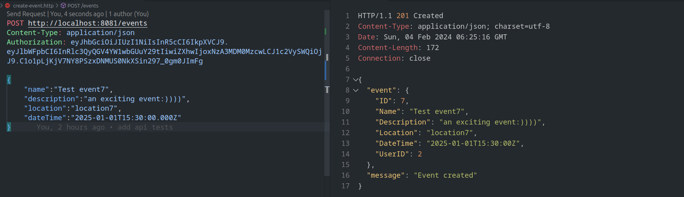

### Get Events
- 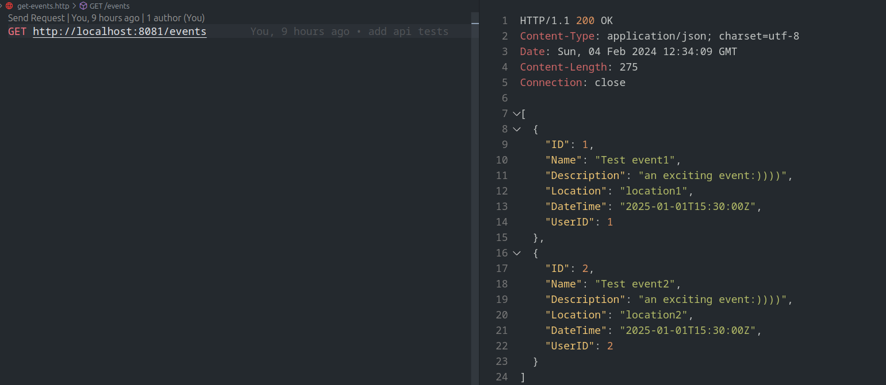

### Delete Event
- 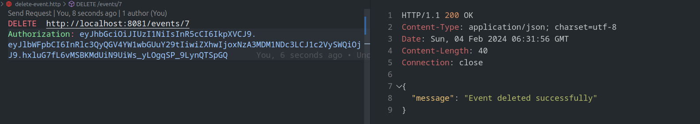

### Sign up user
- 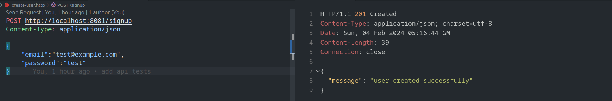
- 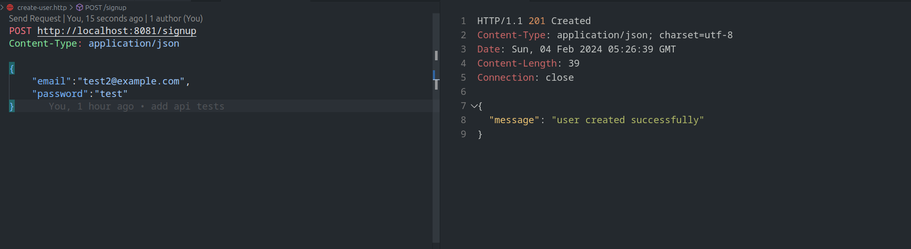

### Login user
- 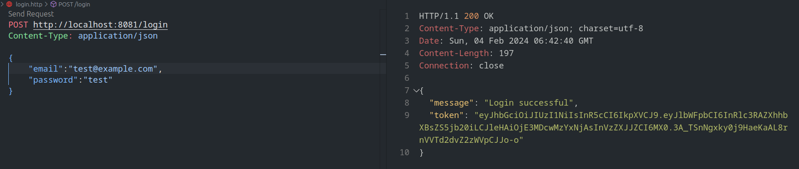
- 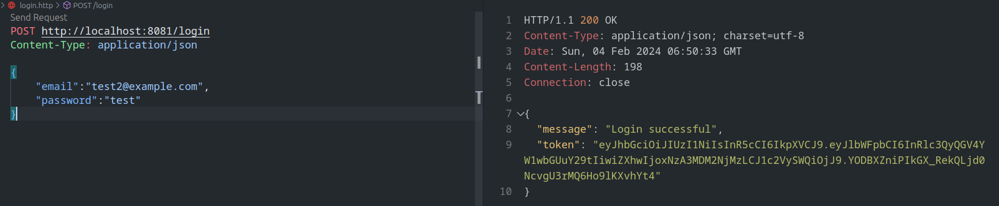

### Get Users
- 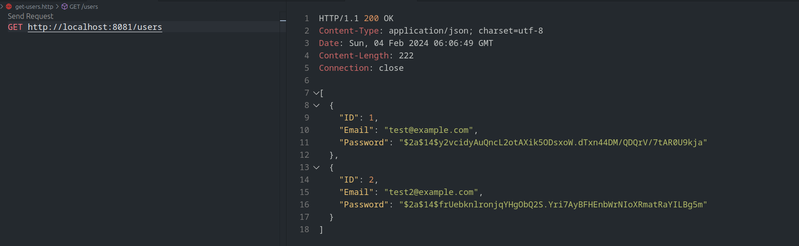

### Login invalid credentials
- 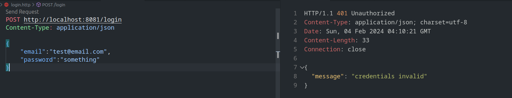

### Register event
- 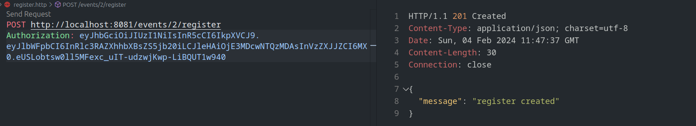

### Cancel Registertion
- 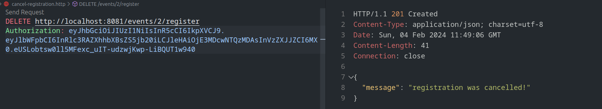